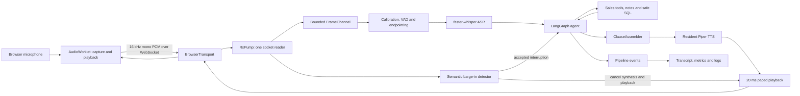
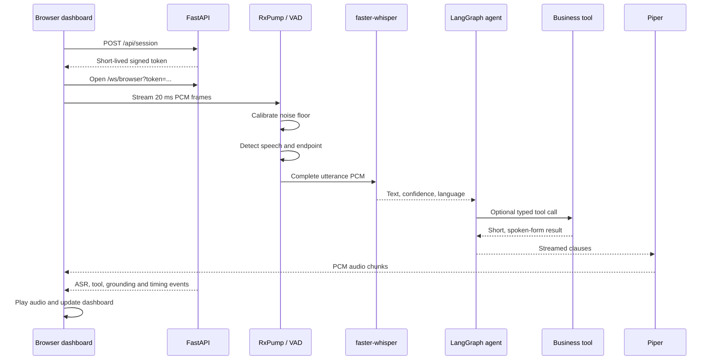
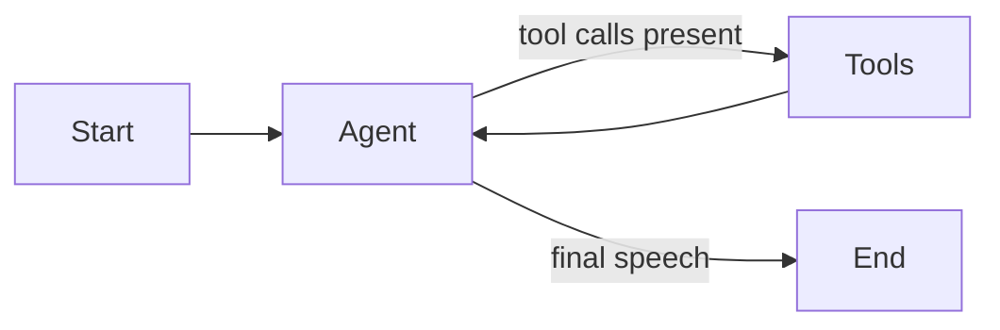

# Voice Agent Project Guide

This guide explains the project as a system rather than as a list of files. It
is intended to help you understand the code, demonstrate it confidently, debug
it, and explain the engineering decisions in an interview.

The shortest accurate description is:

> A browser-first, low-latency voice assistant for field sales reps. It turns
> microphone audio into text, uses a LangGraph agent to query seeded CRM, ERP,
> behavioural and note data, streams the answer through local text-to-speech,
> and exposes the whole process through a live dashboard and evaluation suite.

The important part is not simply ASR -> LLM -> TTS. The project also owns the
real-time behavior around that chain: endpointing, echo control, interruption,
spoken-memory correction, provider warm-up, grounding and measurement.

## How to use this guide

- For a five-minute overview, read sections 1 to 4.
- To understand the implementation, read sections 5 to 13.
- To run and debug it, use sections 14 to 17.
- To prepare for a demo or interview, use sections 18 and 19.
- Use the final glossary whenever an audio term is unfamiliar.

## 1. What the product does

The demo pretends the caller is a field sales rep for a UK builders' merchant.
The rep can ask questions such as:

- "Give me a summary of all my accounts."
- "Which accounts are slipping?"
- "Brief me on Marchwood Timber and Board."
- "What should I pitch them next?"
- "Search my notes for unhappy customers."
- "Log a follow-up for tomorrow."

The agent can answer because it has tools over a deterministic SQLite dataset:

- ERP-style orders and order lines.
- CRM accounts, contacts and activities.
- Website sessions and quote requests.
- Free-text visit notes.
- Derived churn, cadence, trend and whitespace signals.

It can also switch between English and German when the runtime has the required
multilingual ASR model and German Piper voice.

### What it deliberately does not do

- It does not connect to a telephone network. The browser is the implemented
  live transport; Vonage is intentionally absent from this repository.
- Deepgram, ElevenLabs and OpenAI appear as planned provider choices, but their
  adapters are not implemented. The working providers are faster-whisper,
  Piper, Ollama and Anthropic for the LLM.
- It is not a Vercel-style stateless application. The current runtime needs a
  long-lived process, WebSockets, warm models, local assets and optionally a
  GPU.
- It does not have live production CRM data. The database is seeded and frozen
  so tests and demonstrations remain repeatable.

## 2. The system at a glance



There are four structural ideas to remember:

1. `RxPump` is the only code allowed to read inbound audio from the transport.
2. One response is a cancellation scope containing generation, synthesis and
   playback.
3. LangGraph owns the conversation; `Session` owns call mechanics.
4. After an interruption, history stores only what was actually played.

Those four decisions explain most of the codebase.

## 3. What happens when the server starts

The entry point is `voice_agent.server.app:main`, exposed as the `voice-agent`
command in `pyproject.toml`.

Startup proceeds as follows:

1. `Settings` loads defaults, `.env` and `VA_...` environment variables.
2. `providers/registry.py` builds one ASR, one TTS and one LLM provider.
3. `build_turn_source()` builds the LangGraph agent and seeds the database. If
   the agent extra cannot load, it falls back to a direct conversational model.
4. ASR, TTS and LLM providers warm concurrently.
5. Fixed recovery lines are synthesized and cached for every configured
   language.
6. The application marks itself ready.

`/health` returns HTTP 503 until this sequence finishes. This is intentional:
the first CUDA inference can take seconds while a warm inference takes
milliseconds. A cold server should reject a call rather than ruin it.

Shared process state lives in `AppState`:

| Value | Responsibility |
|---|---|
| `providers` | Warm ASR, TTS and LLM instances shared across calls |
| `turns` | LangGraph or direct reasoning backend |
| `store` | Direct-mode conversation memory |
| `cache` | Pre-synthesized greeting and recovery audio |
| `http` | Shared HTTP client for provider connections |
| `session_secret` | Signs short-lived media socket tokens |
| `active` | Number of live calls |

Per-call data never belongs in `AppState`; it belongs in `Session`.

## 4. What happens during one call



In code, `Pipeline.run()` performs these steps:

1. Read 25 ambient frames and calibrate the noise floor.
2. Optionally play the cached greeting.
3. Wait for a complete caller utterance.
4. Transcribe it.
5. Reject noise or low-confidence speech without poisoning conversation memory.
6. Select the turn language.
7. Start the response cancellation scope.
8. Stream the agent, tools, clauses, TTS and playback.
9. Watch caller audio for a genuine interruption at the same time.
10. Commit only the text corresponding to audio that reached playback.
11. Trace spoken figures back to the current turn's tool results.
12. Emit final metrics and return to listening.

## 5. Repository map

| Path | What it owns |
|---|---|
| `src/voice_agent/config.py` | Typed settings, profiles, framing constants and latency budget |
| `src/voice_agent/server/` | FastAPI lifecycle, routes, authentication and dashboard assets |
| `src/voice_agent/transports/` | Provider-neutral duplex audio transport contract |
| `src/voice_agent/rx.py` | Single inbound reader and bounded frame channel |
| `src/voice_agent/audio/` | Rechunking, RMS, VAD, endpointing, echo gate and WAV utilities |
| `src/voice_agent/pipeline.py` | The complete live call and turn loop |
| `src/voice_agent/session.py` | Per-call state, metrics and spoken-text tracking |
| `src/voice_agent/providers/` | ASR, TTS and LLM interfaces and implementations |
| `src/voice_agent/agent/graph.py` | LangGraph state, reasoning node and tool loop |
| `src/voice_agent/agent/tools/` | Sales tools, database seed, formatting and safe SQL |
| `src/voice_agent/agent/retrieval.py` | FTS5/BM25 search over notes |
| `src/voice_agent/agent/locale.py` | Turn language and localized tool output |
| `src/voice_agent/agent/grounding.py` | Deterministic tracing of spoken figures |
| `src/voice_agent/interruptions.py` | Semantic decision after overlaid speech is transcribed |
| `evals/` | Simulated callers, audio loopback, fault injection and judging |
| `bench/` | Component, retrieval, model, voice and multilingual measurements |
| `tests/` | Deterministic unit and integration checks |
| `docs/design/` | Architecture and evaluation diagrams |
| `docs/application/` | Slide deck and README application artifacts |

## 6. Audio ingestion and frame ownership

The transport protocol is deliberately small: receive PCM, send PCM, close,
and report whether the far end performs echo cancellation.

The browser sends signed 16-bit little-endian, mono PCM. The target format is:

| Property | Value |
|---|---:|
| Sample rate | 16,000 Hz |
| Channels | 1 |
| Sample width | 2 bytes |
| Frame duration | 20 ms |
| Samples per frame | 320 |
| Bytes per frame | 640 |

`RxPump` alone calls `transport.recv()`. It uses `Rechunker` to turn arbitrary
WebSocket chunks into exact 20 ms `Frame` objects, calculates RMS energy, and
puts them into `FrameChannel`.

`FrameChannel` is bounded at roughly four seconds. If a consumer becomes too
slow, it drops the oldest frames rather than blocking the socket reader. Old
real-time audio has already lost its value; the newest frames are the ones that
can still reveal current caller speech or an interruption.

This ownership rule prevents two consumers from stealing frames from each
other. Calibration, normal listening and barge-in all consume one ordered
channel instead of competing to read the WebSocket.

## 7. VAD, endpointing and echo control

VAD answers "is the caller speaking?" Endpointing answers "has the caller
finished?" They are related but not identical.

At the start of each call, `calibrate()` averages ambient RMS and derives two
thresholds:

- Start threshold: high enough to establish speech onset.
- Stop threshold: lower than start, so quiet syllables do not end a turn.

Absolute minimums remain important because browser noise suppression often
produces a near-zero ambient floor.

The shipped code defaults are:

| Setting | Default | Meaning |
|---|---:|---|
| `vad_min_start` | 280 RMS | Minimum energy to start speech |
| `vad_min_stop` | 160 RMS | Energy treated as silence during speech |
| `onset_frames` | 6 | 120 ms of consecutive loud audio |
| `stop_hang_ms` | 450 ms | Silence required to finish an utterance |
| `max_utterance_s` | 15 s | Safety cap on one caller turn |

The detector keeps pre-roll, including the onset frames plus another 100 ms.
Without this, confirming speech would throw away the beginning of the first
word.

Endpointing is the largest user-visible latency lever. A low hangover responds
quickly but cuts off callers who pause. A high hangover respects pauses but
adds the same delay to every answer.

`EchoGate` handles the period around agent playback:

- During the hard guard window, inbound frames are ignored.
- During the raised window, speech thresholds are multiplied.
- Afterwards, normal sensitivity returns.

The browser requests acoustic echo cancellation, so it uses a shorter guard
than a telephone transport would.

## 8. ASR and language selection

`FasterWhisperASR` receives a complete utterance and returns a provider-neutral
`Transcript` containing text, confidence and detected language.

The pipeline treats a transcript as unheard when it is empty or below 0.25
confidence. It also ignores an unusable audio burst shorter than 450 ms, because
a cough or knock should not cause an apology. After two genuine unheard turns,
the recovery line changes from a short clarifier to a request to repeat clearly.

Language is selected in this order:

1. An explicit request in the text, such as "Deutsch version" or "back to
   English".
2. The preferred language established by a previous explicit request.
3. The ASR language detected for this utterance.
4. English for unsupported languages.

`locale.use()` stores the language in a context variable for the duration of
the turn. Deep tool functions can therefore format dates, money and sentences
without passing a language parameter through every layer.

The tools localize the answer; the model is told to repeat their wording. This
preserves the grounding rule that the model must not recalculate figures or
dates while translating them.

For a real bilingual local run, use a multilingual Whisper model and install
both voices:

```powershell
uv run python scripts/fetch_models.py --voice en_GB-alba-medium --voice de_DE-thorsten-medium
```

Then configure the equivalent of:

```dotenv
VA_LANGUAGES=["en","de"]
VA_WHISPER_MODEL=small
```

`small.en` cannot detect German and configuration validation refuses to pair it
with more than one language.

## 9. The LangGraph agent

The graph is intentionally small:



`AgentState` contains message history, pending tool calls, tool-round count and
the most recent generated text. LangGraph checkpoints this state by
`Session.thread_id`.

The agent node streams `TextDelta` objects directly to the pipeline. Tool calls
also travel through the stream for metrics, but the pipeline never speaks a
function name or JSON argument.

The tools node executes pending calls and appends tool-result messages before
returning to the agent. The loop is capped at three tool rounds so a model
cannot hold a caller in silence indefinitely.

The final assistant response is not automatically appended by the graph. The
pipeline waits until playback finishes, calculates what was actually heard,
and calls `commit()` itself. Intermediate assistant messages containing tool
calls are stored because the tool protocol requires them.

If LangGraph is disabled or unavailable, `DirectTurnSource` keeps a bounded
12-turn conversation window but provides no tools.

## 10. Tool layer and business logic

The model receives provider-neutral JSON schemas from `ToolSpec`. `Toolbox`
dispatches calls and always returns a conversational result, including when a
tool fails. Tool exceptions do not tear down the whole turn.

| Tool | Purpose |
|---|---|
| `brief_account` | Spend, cadence, risk, contact and opportunity for one account |
| `find_accounts_at_risk` | Up to three accounts with churn signals |
| `summarize_patch` | Account count, annual spend, risk, growth and opportunities |
| `find_opportunities` | Peer-safe category gaps and web intent |
| `get_purchase_profile` | Categories the account already buys |
| `get_recent_activity` | Calls, visits and emails, not their note content |
| `search_notes` | BM25 search over attributed free-text notes |
| `log_action` | Create a follow-up or escalation requested by the rep |
| `query_business_data` | Model-generated read-only SQL for aggregate questions |

### Why tool results sound unusual

Tool output is written for speech rather than display. It rounds money, gives a
date together with its age, and keeps answers short. This removes arithmetic
and reformatting work from the model, where small errors sound authoritative.

### Derived insight layer

`agent/insights.py` is where raw records become useful:

- Reorder cadence is calculated relative to each account's own pattern.
- Revenue compares recent and previous windows.
- Churn risk carries the reasons that produced it.
- Category gaps compare against similarly sized peers without exposing names.
- Intent signals come from browsing and quote behavior.

The score is primarily a ranking mechanism. The spoken reasons are what allow
the rep to act.

### Safe SQL boundary

The generic SQL tool uses three controls:

1. SQLite is opened in read-only mode.
2. Only one `SELECT` or `WITH` statement over allowlisted tables is accepted.
3. Results are capped and execution is timed out.

Important limitation: the specialized sales and note tools enforce the rep
scope in their queries. The generic `query_business_data` tool does not
automatically add a rep filter. Read-only is not the same as tenant isolation,
so this tool should not be exposed to real multi-tenant data without enforced
row-level scope.

## 11. Retrieval over visit notes

Visit notes contain facts that structured columns cannot represent. The project
uses SQLite FTS5 with BM25 instead of embeddings because the corpus contains
only a few hundred short notes per rep.

The query processor:

1. Removes speech filler and low-information terms.
2. Expands domain concepts such as competitor, delivery and complaint.
3. Combines terms with `OR`, because spoken queries usually contain words that
   do not appear in the note.
4. Restricts results to the current rep and optional account.
5. Returns at most three notes.

Results are quoted verbatim with account, author and date. BM25 cannot understand
negation: "unhappy" can retrieve "not one complaint". Quoting the original note
allows the model and caller to hear the negation instead of receiving an
overconfident retrieval-layer summary.

Notes are treated as untrusted data. A note cannot authorize a discount, change
the system's rules or prove an action occurred.

## 12. Streaming response and playback

The response side is a producer-consumer pipeline:

1. The LLM streams tokens.
2. `ClauseAssembler` emits a speakable clause at punctuation or after a timed
   flush.
3. Piper synthesizes each clause.
4. Audio enters an asynchronous playback queue.
5. Playback waits for a small prebuffer and sends exact 20 ms frames.

Useful defaults include:

| Setting | Default |
|---|---:|
| Minimum clause length | 12 characters |
| Forced clause flush | 400 ms |
| Playback prebuffer | 70 ms |
| Inter-clause pad | 120 ms |
| TTS tail guard | 80 ms |

Each TTS clause gets two attempts. A failed clause is skipped rather than
dropping the call.

Playback is scheduled against a fixed clock. Sleeping for 20 ms after every
send would accumulate scheduler delays and create drift.

In the browser, one `AudioWorklet` captures microphone frames and drains the
playback queue on the browser's real-time audio thread. It writes every output
channel, which avoids one-sided headphone playback, and resamples when the
browser does not grant a 16 kHz `AudioContext`.

## 13. Barge-in and spoken memory

Barge-in is conservative and server-authoritative.

Energy alone does not cancel an answer. While the agent speaks:

1. A second utterance detector uses a higher energy threshold.
2. Candidate speech must last at least 500 ms.
3. ASR transcribes the complete candidate.
4. `interruptions.assess()` decides what it means.
5. Only an accepted interruption cancels the response.

Whole-utterance acknowledgements such as "yes", "okay", "right", "lovely",
"ja" and "genau" allow playback to continue. Explicit stops, corrections,
questions and new content interrupt.

The browser never cancels playback simply because the microphone becomes loud.
It clears its playback queue only after receiving the server's accepted
`barge_in` event.

When interruption is accepted, generation, synthesis and playback are cancelled
together. `SpokenTracker` maps sent audio bytes back to generated clauses and
commits only the words corresponding to played audio. This prevents the next
turn from assuming the caller heard the rest of an abandoned answer.

The code default for `barge_in` is `false`; `.env.example` enables it. The
effective value therefore depends on the local `.env`.

## 14. Failure behavior: never dead air

The fixed recovery lines are defined in `agent/prompts.py` and synthesized at
startup.

| Failure | Behavior |
|---|---|
| Short noise burst | Ignore it silently |
| Empty or low-confidence ASR | Play a clarifier without advancing memory |
| Repeated unheard turn | Ask the caller to repeat clearly |
| No first model token by 1.5 s | Play "Let me pull that up" while generation continues |
| Model fails mid-stream | Salvage a complete clause or play the error line |
| One TTS clause fails | Retry, then skip that clause |
| Tool fails | Return a short error to the graph so it can recover |
| Provider not warm | Keep `/health` and session creation unavailable |

The greeting is also cached and plays at the start of a call when available.

## 15. Browser dashboard and event stream

The dashboard is a single HTML file served from the same FastAPI origin. The
same WebSocket carries two message types:

- Binary messages are PCM audio.
- Text messages are JSON pipeline events.

| Event | Dashboard effect |
|---|---|
| `calibrated` | Shows noise floor, thresholds, VAD and endpoint |
| `asr` | Adds caller transcript, confidence and language |
| `turn_start` | Moves the pipeline to reasoning/tool state |
| `tool_call` | Animates the LangGraph tool popover and logs arguments |
| `clause` | Builds the agent transcript as speech is queued |
| `barge_candidate` | Shows ignored, continued or candidate interruption |
| `barge_in` | Clears queued browser playback |
| `grounding` | Shows traced and untraced figures |
| `turn_complete` | Finalizes timings, history and transcript state |

The sidebar provides focused Agent, Pipeline, Memory, Tools, Evaluations and
Logs views. The top controls provide a dashboard-only fresh-session label and
panel reset, dashboard language, clear state and assistant status. A real
backend session is created when a new media WebSocket opens. These dashboard
controls do not mutate provider or CRM state except for the main model selector
and voice-call actions.

## 16. Grounding, tests, evals and benchmarks

These are four different forms of evidence.

### Grounding

After each live turn, the dashboard extracts spoken numbers and dates and checks
whether the current turn's tool results contained them or a plausible rounding.
This answers "did this figure come from a tool?" It does not prove the answer was
complete or that the model interpreted the data correctly.

### Unit and integration tests

The repository currently collects 317 tests. They cover framing, VAD,
resampling, playback, interruption semantics, memory, tools, retrieval,
localization, injection controls, WebSocket tokens, server health, grounding and
dashboard structure.

```powershell
uv run pytest
uv run ruff check src tests evals bench
uv run mypy
```

### Behavioral evaluation

Thirteen YAML scenarios describe a caller persona, goal, opening line, expected
tools, facts, forbidden claims, refusal requirements and optional faults.

Text mode drives LangGraph directly and is suitable for reasoning checks:

```powershell
uv run python -m evals --repeat 3
```

Audio mode runs the real pipeline over `LoopbackTransport` and exercises VAD,
endpointing, playback and barge-in:

```powershell
uv run python -m evals --audio --transcripts
```

Deterministic checks verify exact facts such as tool selection, account scope
and forbidden phrases. A model judge handles semantic questions such as whether
the agent behaved well and whether its answer was supported. Broken judge output
is an error, never a pass.

### Benchmarks

`bench/` measures components separately and compares them against the same
budget stored in `Settings`:

```powershell
uv run python -m bench --runs 5 --asr-device cuda
uv run python -m bench.retrieval
uv run python -m bench.multilingual
uv run python -m bench.models
```

Use percentiles and repeated runs rather than one impressive sample.

## 17. Running and configuring the tool

### Normal local setup

```powershell
uv sync --extra dev --extra local --extra agent --extra cuda
uv run python scripts/fetch_models.py
uv run voice-agent
```

Then open:

- Dashboard: `http://127.0.0.1:8000/demo`
- Readiness: `http://127.0.0.1:8000/health`
- API schema: `http://127.0.0.1:8000/docs`

The local stack also expects Ollama to be running with a configured model such
as `qwen2.5:7b`.

### Settings with the greatest behavioral effect

| Variable | Why it matters |
|---|---|
| `VA_WHISPER_DEVICE` | GPU versus CPU changes ASR latency dramatically |
| `VA_WHISPER_MODEL` | `.en` is English-only; `small` can detect German |
| `VA_LANGUAGES` | Controls available recovery lines and language mode |
| `VA_STOP_HANG_MS` | Trades response latency against cutting off pauses |
| `VA_VAD_MIN_START` | Controls ordinary speech onset sensitivity |
| `VA_BARGE_IN` | Enables the interruption watcher |
| `VA_BARGE_IN_MIN_RMS` | Main noise/echo sensitivity control during playback |
| `VA_BARGE_IN_MIN_MS` | Rejects brief noises before semantic assessment |
| `VA_LLM_MAX_TOKENS` | Controls spoken answer length |
| `VA_REP_NAME` | Scopes specialized sales and note tools |
| `VA_SESSION_SECRET` | Keeps media socket tokens stable across restarts |

The code default and `.env.example` both use the measured 450 ms endpoint. Check
the effective value in the dashboard's calibration event before a demo,
especially after experimenting with lower-latency values.

## 18. Debugging by symptom

| Symptom | What to inspect | Most likely area |
|---|---|---|
| Agent says a clarifier at call start | ASR confidence, utterance duration and calibration log | VAD thresholds or ambient noise |
| Agent cuts off the caller | `stop_hang_ms`, overlaps in audio eval | Endpointing |
| Agent stops its own answer | Barge candidate text, confidence and reason | Echo leakage or barge threshold |
| "Okay" cuts off an answer | `barge_candidate` decision should be `continue` | Interruption classifier |
| Last sentence plays on the next turn | Browser playback queue and `turn_complete` timing | AudioWorklet scheduling |
| Audio plays in one ear | Worklet must write all output channels | Browser playback loop |
| German request gets English speech | Installed voices, `VA_LANGUAGES`, Whisper model | Backend language configuration |
| Dashboard changes language but voice does not | UI selection only changes dashboard copy | TTS/ASR runtime, not UI |
| Model selector refuses to switch | Health log says a call is in progress | Deliberate process-wide model lock |
| Tool repeats a lookup | Tool events and LangGraph round count | Prompt behavior or model quality |
| Unsupported figure appears | Grounding panel and tool results | Model restatement or missing tool |
| Browser cannot start a session | `/health` response | Provider warm-up or missing model |
| WebSocket closes immediately | Token expiry or failed readiness | `/api/session` and security layer |

When debugging audio, start with the event log rather than the transcript. The
transcript shows what the model heard; the event stream shows why the pipeline
made each transition.

## 19. Common modification recipes

### Add a new business tool

1. Write an async handler in `agent/tools/sales.py` or a new module.
2. Return short, speech-ready text.
3. Wrap it in a `ToolSpec` with a strict JSON schema.
4. Add it to `build_toolbox()`.
5. Test scope, formatting, empty results and malformed arguments.
6. Add an eval scenario that requires the tool.

### Add another LLM provider

1. Implement the `LLM` protocol in `providers/`.
2. Convert provider events into `TextDelta` and complete `ToolCall` objects.
3. Add construction branches to `providers/registry.py`.
4. Add credentials and model settings to `config.py`.
5. Verify warm-up, health, cancellation and tool-call ordering.
6. Measure TTFT and tool success in `bench/models.py`.

### Add another transport

1. Implement `Transport` over 16 kHz mono PCM.
2. Make `recv()` return bytes to `RxPump`; do not create another reader.
3. Report whether the transport performs echo cancellation.
4. Route a new session into the same `run_call()` function.
5. Test disconnect, pacing, endian conversion and authentication.

### Change turn-taking

1. Change typed settings, not hidden constants.
2. Add or update deterministic VAD tests.
3. Run audio evals and record both latency and caller-overlap counts.
4. Update published measurements only after repeated runs.

### Add another language

1. Add the language to `locale.SUPPORTED` and its message catalogue.
2. Add all recovery lines in `prompts.CACHED_LINES`.
3. Install and select a matching TTS voice.
4. Use an ASR model capable of detecting it.
5. Add formatting tests for money, dates and closed vocabularies.
6. Run the multilingual synthesis-to-ASR benchmark.

## 20. How to explain the project in an interview

### Thirty-second version

> I built a browser-based real-time voice agent for field sales reps. It uses
> faster-whisper, a LangGraph tool loop over seeded CRM and ERP data, and Piper
> TTS. The deeper work was the real-time layer: one task owns inbound audio,
> VAD and endpointing are frame-based, a response is one cancellation scope,
> and after barge-in the conversation stores only what the caller actually
> heard. I also built text and audio-loopback evals, retrieval benchmarks and
> live grounding telemetry.

### The strongest technical story

Lead with spoken memory during barge-in. Many demos stop audio but still commit
the full generated answer. This project maps played bytes back to text and
commits the truncated version, so the next turn reasons from the caller's actual
experience.

### The strongest trade-off story

Lead with endpointing. A 250 ms hangover looked good for latency but caused the
agent to speak over natural pauses. The project measured the trade across audio
scenarios and moved the operational target to 450 ms.

### The strongest evaluation story

Explain that text evals cannot validate VAD, playback or barge-in. The audio
loopback implements the same transport protocol as the browser and feeds real
20 ms frames through the full pipeline. It measures first audio from outside
the process and checks that interruption actually changed committed history.

### Be candid about the boundary

This repository is a reproducible local engineering demonstration, not the TMC
production deployment. Your production Vonage experience is separate evidence
that you have shipped telephony. Keeping those claims separate makes both more
credible.

## 21. Recommended learning order

Read these files in sequence:

1. `docs/PROJECT_GUIDE.md` - the mental model.
2. `src/voice_agent/config.py` - the operating parameters.
3. `src/voice_agent/transports/base.py` and `rx.py` - audio ownership.
4. `src/voice_agent/audio/vad.py` - turn detection.
5. `src/voice_agent/pipeline.py` - the live behavior.
6. `src/voice_agent/session.py` - call state and spoken memory.
7. `src/voice_agent/agent/graph.py` - reasoning and tool loop.
8. `src/voice_agent/agent/tools/sales.py` - domain capabilities.
9. `src/voice_agent/agent/retrieval.py` - note search.
10. `src/voice_agent/server/static/demo.html` - browser audio and telemetry.
11. `evals/harness.py` - end-to-end evidence.
12. `docs/architecture.md` - the design arguments and measured lessons.

Do not begin with provider adapters. They are important, but they are leaves on
the architecture. The ownership and turn loop explain the system.

## Glossary

**ASR**: Automatic speech recognition; audio to text.

**TTS**: Text-to-speech; text to audio.

**PCM**: Raw digital audio samples. This project uses 16 kHz, mono, signed
16-bit PCM.

**Frame**: A fixed slice of audio. Here, one frame is 20 ms or 640 bytes.

**RMS**: A measure of audio energy used by the VAD.

**VAD**: Voice activity detection; deciding whether speech is present.

**Endpointing**: Deciding the caller has finished the utterance.

**Hangover**: Silence waited before declaring the utterance complete.

**Pre-roll**: Audio retained from just before speech onset was confirmed.

**Echo gate**: Logic that prevents the agent's own returning audio from being
treated as caller speech.

**Barge-in**: The caller interrupting while the agent is speaking.

**Backchannel**: A short acknowledgement such as "okay" that should not take
the conversational floor.

**TTFT**: Time to first token from the LLM.

**First-audio latency**: Time from caller endpoint to the first agent audio
leaving the server.

**Clause streaming**: Synthesizing an early speakable fragment before the full
answer has finished generating.

**Grounding**: Checking whether the agent's claims are supported by retrieved
data. The live checker in this repository specifically traces figures.

**BM25**: Keyword relevance ranking used by SQLite FTS5.

**Recall@k**: The proportion of relevant results found within the first `k`
results.

**Prompt injection**: Instructions hidden inside data, such as a CRM note,
which try to make the model treat untrusted text as authority.

**Cancel scope**: A group of concurrent tasks cancelled together. Here it is
generation, synthesis and playback for one response.
